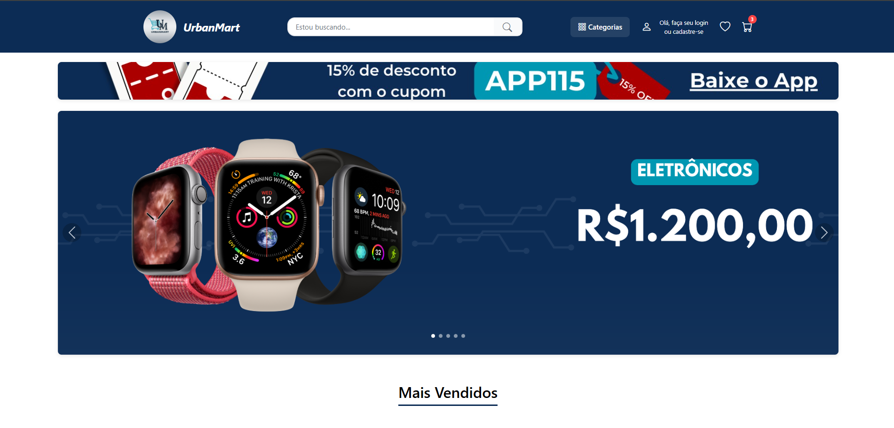

# 📦 Projeto simulação de E-commerce (Refatoração)

Este projeto é inspirado em um e-commerce que estou desenvolvendo como parte do meu aprendizado contínuo em desenvolvimento web  
Esta versão representa uma **refatoração do projeto original**, onde o foco foi melhorar a arquitetura, o design e adicionar novas funcionalidades.

O layout foi totalmente repensado, seguindo uma abordagem **mobile first**, com uma interface mais moderna e funcional. A ideia é continuar evoluindo o projeto, integrando uma API e um banco de dados no futuro.

Atualmente, o projeto conta com funcionalidades essenciais de um e-commerce, como:

- Autenticação de usuário  
- Carrinho de compras  
- Sistema de favoritos  
- Barra de navegação dinâmica  
- Filtros por categorias e pesquisa  
- Sistema CRUD (criar, editar e atualizar dados do usuário)

---

## 🔐 Autenticação e Armazenamento

Foram utilizados recursos nativos do navegador, como o **Local Storage**, para simular uma experiência real de autenticação e persistência de dados.  
A autenticação conta com validação local e **simulação de hash de senha**, reforçando boas práticas de segurança mesmo em um projeto de estudo.

Dados como carrinho, favoritos e informações do usuário também são armazenados localmente.

---

## 🧠 Gerenciamento de Estado

Para o gerenciamento de estado da aplicação, foram exploradas as seguintes abordagens:

- **Recoil** (principalmente para autenticação)
- **React Context API** (carrinho, favoritos e pesquisa)

Essa estratégia permitiu organizar melhor os fluxos globais de dados, evitando *prop drilling* e facilitando a manutenção do código.

---

## 🧭 Rotas e Navegação

O gerenciamento de rotas foi implementado com **React Router DOM**, permitindo:

- Navegação entre páginas  
- Rotas dinâmicas (ex: produto por ID)  
- Organização das rotas em uma pasta dedicada, melhorando a arquitetura do projeto  

---

## 🎨 Estilização e UI

A estilização foi pensada para facilitar manutenção e escalabilidade:

- **SCSS** para organização de estilos, variáveis e mixins  
- **Styled Components** para componentes que exigem maior controle de layout  
- **Bootstrap** para componentes como modal, off-canvas e melhorias de UX  

---

## 🚀 Próximos Passos

- Integração com uma API externa  
- Persistência de dados em banco de dados  
- Expansão das funcionalidades do CRUD  
- Melhorias contínuas de performance e experiência do usuário  

---

## 🛠️ Tecnologias Utilizadas

- React + TypeScript  
- SCSS  
- Styled Components  
- React Router DOM  
- Bootstrap  
- Recoil  
- Context API  
- Local Storage  

---

## 🔗 Link do Projeto

https://urban-mart-ten.vercel.app/

